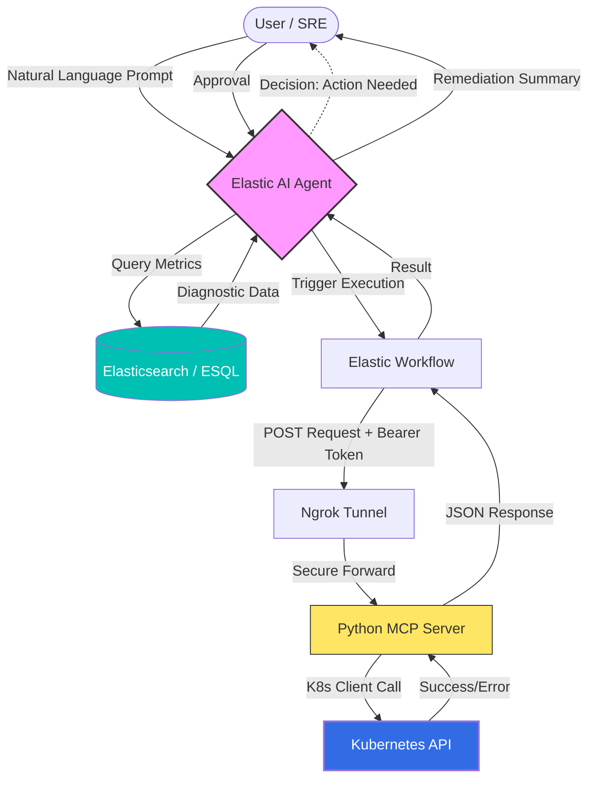

# 🛡️ K8s Agent from responses to actions: Elastic AI Agent + MCP Infrastructure

This project demonstrates how to build an **Automated SRE Loop** using Elastic AI, a custom Model Context Protocol (MCP) server, and Kubernetes.

## 🎯 Project Overview

The mission is to **transform a passive k8s monitoring agent**  into an **active remediation system**. Instead of just receiving an alert, the AI Agent:

1. **Analyzes** k8s metrics using ESQL.
2. **Identifies** the root cause (e.g., OOMKilled, scaling bottlenecks).
3. **Acts** by triggering a Workflow that communicates with a Python-based MCP server to modify the K8s cluster.


### 🏗️ Project Architecture

### 🏗️ Project Architecture



---

## 🐍 1. The Execution Bridge: Python MCP Server

The `mcp-k8s.py` script is a FastAPI-based bridge that translates JSON requests from Elastic into official Kubernetes API calls.

### Core Capabilities

* **Vertical Scaling**: Patches memory limits.
* **Horizontal Scaling**: Adjusts replica counts.
* **Restarts**: Triggers restarts.
* **Observability**: Fetches real-time pod status.
```python
import uvicorn
from fastapi import FastAPI, HTTPException, Header
from pydantic import BaseModel
from typing import Optional
from kubernetes import client, config
from datetime import datetime

app = FastAPI()

# Load K8s Config (Ensure your context is set to the correct cluster)
try:
    config.load_kube_config()
except Exception as e:
    print(f"❌ Critical Error: Could not load K8s config: {e}")

apps_v1 = client.AppsV1Api()
# SHARED SECRET: Must match the Workflow token
API_TOKEN = "6f8e2d4a1b9c3e5f7a0b2d4c6e8f0a1b3c5d7e9f2a4b6c8d"

class ManageRequest(BaseModel):
    action: str             # Options: "scale", "restart", "status", "update_resources"
    deployment: str
    namespace: str = "default"
    replicas: Optional[int] = 1
    memory_limit: Optional[str] = None

@app.post("/manage")
async def manage_deployment(request: ManageRequest, authorization: str = Header(None)):
    if authorization != f"Bearer {API_TOKEN}":
        raise HTTPException(status_code=401, detail="Unauthorized: Invalid MCP Token")

    try:
        # --- ACTION: UPDATE_RESOURCES ---
        if request.action == "update_resources":
            deploy = apps_v1.read_namespaced_deployment(name=request.deployment, namespace=request.namespace)
            container_name = deploy.spec.template.spec.containers[0].name
            resource_patch = {"spec": {"template": {"spec": {"containers": [{"name": container_name, "resources": {"limits": {"memory": request.memory_limit}}}]}}}}
            apps_v1.patch_namespaced_deployment(name=request.deployment, namespace=request.namespace, body=resource_patch)
            return {"status": "success", "message": f"Vertical scaling applied: '{request.deployment}' memory updated to {request.memory_limit}."}

        # --- ACTION: SCALE ---
        elif request.action == "scale":
            scale_patch = {"spec": {"replicas": request.replicas}}
            apps_v1.patch_namespaced_deployment_scale(name=request.deployment, namespace=request.namespace, body=scale_patch)
            return {"status": "success", "message": f"Horizontal scaling applied: '{request.deployment}' set to {request.replicas} replicas."}

        # --- ACTION: RESTART ---
        elif request.action == "restart":
            timestamp = datetime.utcnow().isoformat() + "Z"
            restart_patch = {"spec": {"template": {"metadata": {"annotations": {"kubectl.kubernetes.io/restartedAt": timestamp}}}}}
            apps_v1.patch_namespaced_deployment(name=request.deployment, namespace=request.namespace, body=restart_patch)
            return {"status": "success", "message": f"Rollout restart triggered for '{request.deployment}'."}

        # --- ACTION: STATUS ---
        elif request.action == "status":
            deploy_info = apps_v1.read_namespaced_deployment(name=request.deployment, namespace=request.namespace)
            s = deploy_info.status
            return {"status": "success", "message": f"Status: {s.available_replicas or 0}/{s.replicas} pods ready."}

    except Exception as e:
        raise HTTPException(status_code=500, detail=f"Error: {str(e)}")

if __name__ == "__main__":
    uvicorn.run(app, host="0.0.0.0", port=8000)

```

---

## 🌐 2. Connectivity: The ngrok Sync Trick

To connect the Elastic SaaS environment to your local MCP server, we use **ngrok**.

### The Security & Connectivity Logic:

1. **The URL**: Run `ngrok http 8000`. Copy the **Forwarding URL** (e.g., `https://[id].ngrok-free.dev`).
2. **The Token**: We use a static `API_TOKEN` to ensure only Elastic can talk to your cluster.
3. **The Bypass**: We add the `ngrok-skip-browser-warning` header so the AI Agent doesn't get stuck on ngrok's splash page.

> **Crucial Sync**: Ensure the `API_TOKEN` in the Python script and the `mcp_token` in the Workflow YAML are **identical**.

---

## ⚙️ 3. The Orchestrator: Elastic Workflow

Paste this YAML into the **Workflows** section of Elastic. It defines how the Agent sends commands to the Bridge.

```yaml
# Elastic Workflow Version
version: "1"

# Metadata
name: Kubernetes Management MCP
description: "Professional K8s management: Scale, Restart, Status, and Memory Updates."
tags:
  - k8s
  - mcp
  - automation

# Trigger configuration
triggers:
  - type: manual

# Input parameters definition (Enum removed for compatibility)
inputs:
  - name: action
    description: "Supported: scale | restart | status | update_resources"
    type: string
    required: true
    default: "status"
  - name: deployment_name
    description: "Target deployment name"
    type: string
    required: true
    default: "my-service"
  - name: desired_replicas
    description: "Target pod count (Used for 'scale')"
    type: number
    required: false
    default: 1
  - name: memory_limit
    description: "New memory limit (Used for 'update_resources', e.g., '512Mi')"
    type: string
    required: false
    default: "256Mi"
  - name: namespace
    description: "K8s namespace target"
    type: string
    required: true
    default: "default"

# Fixed configurations
consts:
  mcp_bridge_url: "https://hegemonic-multinucleate-margaret.ngrok-free.dev/manage"
  mcp_token: "6f8e2d4a1b9c3e5f7a0b2d4c6e8f0a1b3c5d7e9f2a4b6c8d"

steps:
  # Step 1: Informative log to help the user identify errors
  - name: log_intent
    type: console
    with:
      message: "Processing '{{ inputs.action }}' for '{{ inputs.deployment_name }}'. Note: Action must be one of [scale, restart, status, update_resources]."

  # Step 2: API Call to the local mcp-k8s.py bridge
  - name: call_bridge
    type: http
    with:
      url: "{{ consts.mcp_bridge_url }}"
      method: POST
      headers:
        Content-Type: application/json
        Authorization: "Bearer {{ consts.mcp_token }}"
        ngrok-skip-browser-warning: "true"
      body:
        action: "{{ inputs.action }}"
        deployment: "{{ inputs.deployment_name }}"
        namespace: "{{ inputs.namespace }}"
        # Use Handlebars to ensure data types are clean
        replicas: "{{ inputs.desired_replicas }}"
        memory_limit: "{{ inputs.memory_limit }}"
      timeout: 60s

  # Step 3: Parse and display the result
  - name: verify_response
    type: console
    with:
      message: "Bridge response: {{ steps.call_bridge.output.data.message }}"

  # Step 4: Final execution status
  - name: completion_log
    type: console
    with:
      message: "Workflow finished with HTTP status {{ steps.call_bridge.output.status }}."

```

---

## 🧠 4. AI Agent Configuration (Prompts & ESQL)

### System Instructions

To guide the AI's behavior, use the following prompt in the **Agent Instructions**:

> "You are an expert SRE. Your objective is to resolve K8s issues.
> 1. Use **ESQL** to verify data (logs/metrics) before taking action.
> 2. If a pod shows `OOMKilled` events, use `update_resources` to increase memory.
> 3. If a deployment has high latency but low CPU usage, use `scale` to add replicas.
> 4. Always provide a summary of the action taken and its result."
> 
> 

### Diagnostic ESQL Queries

The Agent will use these to "see" the **deployments state**:

````
// -----------------------------------------------------------------------------
// K8S DEPLOYMENT HEALTH AUDIT (OTEL-DEMO)
// This query aggregates usage, limits, and stability metrics to identify 
// remediation actions (Scale, Restart, or Update Resources).
// -----------------------------------------------------------------------------

// 1. Combine data from Kubelet (Usage) and Cluster Receiver (Metadata/Limits)
FROM metrics-kubeletstatsreceiver.otel-*, metrics-k8sclusterreceiver.otel-*

// 2. Filter for our target namespace and ensure we only analyze actual Deployments
| WHERE kubernetes.namespace == "otel-demo" 
  AND kubernetes.deployment.name IS NOT NULL

// 3. Apply a dynamic time window based on the Agent's input (e.g., last 15, 30, 60 mins)
| WHERE DATE_DIFF("minutes", @timestamp, NOW()) <= TO_INTEGER(?minutes_count)

// 4. Aggregate metrics by Deployment name
| STATS 
    // Count unique pods currently reporting metrics
    actual_pods = COUNT_DISTINCT(kubernetes.pod.name),
    
    // Get the most recent heartbeat timestamp
    last_seen = MAX(@timestamp),
    
    // Get the latest desired and available counts from the cluster state
    desired = LAST(metrics.k8s.deployment.desired, @timestamp),
    available = LAST(metrics.k8s.deployment.available, @timestamp),
    
    // Average resource usage across all pods in the deployment
    cpu_usage = AVG(metrics.container.cpu.usage),
    mem_usage = AVG(metrics.container.memory.working_set),
    
    // Capture configured limits (Used for saturation math)
    cpu_limit = MAX(metrics.k8s.container.cpu_request),
    mem_limit = MAX(metrics.k8s.container.memory_limit),
    
    // Track the highest restart count found in any pod of this deployment
    restarts = MAX(metrics.k8s.container.restarts)
  BY kubernetes.deployment.name

// 5. Calculate SRE Performance Indicators (KPIs)
| EVAL 
    // Calculate saturation percentages (Usage vs Limit)
    cpu_pct = ROUND(cpu_usage / cpu_limit * 100, 2),
    mem_pct = ROUND(mem_usage / mem_limit * 100, 2),
    
    // Calculate the scaling gap (If > 0, K8s is failing to meet desired state)
    gap = desired - available

// 6. Severity Scoring Engine (Source of Truth for AI Actions)
| EVAL severity_score = CASE(
    // 🔴 Critical: High Memory Pressure or unstable pods
    mem_pct > 90.0 OR restarts > 10, 3, 
    
    // 🟠 Warning: Scaling lag or missing resource definitions (No QoS)
    gap > 0 OR cpu_limit IS NULL OR mem_limit IS NULL, 2, 
    
    // 🟢 Healthy
    1 
  )

// 7. Format final output for the AI Agent's table
| KEEP 
    kubernetes.deployment.name, 
    severity_score, 
    actual_pods, 
    last_seen, 
    desired, 
    mem_pct, 
    restarts, 
    gap

// 8. Order by highest risk first to ensure critical issues are addressed immediately
| SORT severity_score DESC, restarts DESC
````

---

## 🧪 5. Validation Test Plan

Use these prompts in the Elastic AI Assistant to test the integration:

| Test Scenario | User Prompt | Expected Outcome |
| --- | --- | --- |
| **Status Check** | "Check the status of the 'billing-service' deployment." | Agent calls MCP and returns pod readiness count. |
| **Horizontal Scale** | "Scale the 'frontend' deployment to 4 replicas." | MCP updates K8s; Agent confirms the new count. |
| **Memory Tuning** | "The backend is crashing. Set its memory limit to 512Mi." | MCP applies a strategic merge patch to the deployment. |
| **Force Restart** | "Perform a rolling restart of the 'auth-api' service." | MCP updates the timestamp annotation; K8s cycles pods. |

---
